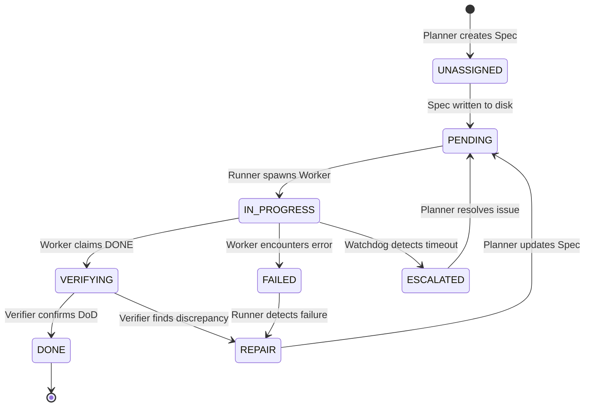

# Low-Level Design: OpenClaw Autonomous Agent Framework (OAAF)

**Version:** 1.0  
**Status:** Draft / Principal Review  
**Author:** Jubi (Sage-Engineer)  
**Target Platform:** OpenClaw Gateway / Workspace  

---

## 1. Executive Summary
The **OpenClaw Autonomous Agent Framework (OAAF)** is a highly disciplined, event-driven architecture designed to enable reliable, multi-step autonomous work within the ephemeral session model of OpenClaw. 

Unlike traditional "long-running" agents that rely on a single, massive, and expensive context window, OAAF treats autonomy as a **distributed state machine**. It breaks complex objectives into discrete, verifiable, and isolated sub-tasks, managed by a deterministic orchestration layer. This minimizes reasoning waste, maximizes security through "Guardians," and ensures persistence across Gateway restarts or session timeouts.

---

## 2. Architectural Principles

### 2.1 Append-Only Truth (The Ledger)
To solve the problem of state loss in ephemeral sessions, OAAF utilizes an **Append-Only Ledger** (`tasks.jsonl`). 
- **Rationale:** Traditional databases introduce complexity and external dependencies. A JSONL file is lightweight, human-readable, and provides an immutable audit trail.
- **Crash-Safety:** In the event of a process crash, the last valid line in the ledger defines the state. We never "update" a task; we append a new event that changes the status of a task.

### 2.2 Deterministic Guardrails (The Guardians)
LLMs are probabilistic; engineering must be deterministic.
- **Rationale:** We do not ask the LLM "Did you do this correctly?" We use Python-based **Guardians** (Linter, Verifier, Watchdog) to check the physical reality of the workspace against the claims made in the ledger.

### 2.3 Lane Exclusivity & Isolation
- **Rationale:** To prevent race conditions and file corruption, the framework implements **Lane Exclusivity**. Only one "Worker" may hold a lease on a specific resource (or "Lane") at any time.
- **Implementation:** Handled via the `Runner` and `lock.py` logic, ensuring that even if multiple automations trigger, they respect the single-writer constraint.

---

## 3. Data Contracts & Schemas

### 3.1 The Task Entry Schema (`tasks.jsonl`)
Every entry in the ledger must be a single-line JSON object.

```json
{
  "timestamp": "2026-09-14T10:45:00Z",
  "task_id": "uuid-v4",
  "event": "TASK_CLAIMED | TASK_COMPLETED | TASK_FAILED | TASK_ESCALATED",
  "actor": "runner | worker_session_id | planner_session_id",
  "metadata": {
    "spec_ref": "specs/task_name.md",
    "lane": "filesystem/path/or/resource_id",
    "attempt": 1
  },
  "payload": {
    "message": "Optional human-readable summary",
    "evidence_ref": "evidence/log_abc.txt",
    "error": "Detailed error if FAILED"
  }
}
```

#### Ledger Field Definitions
| Field | Type | Description |
| :--- | :--- | :--- |
| `timestamp` | ISO8601 | The UTC time of the event. |
| `task_id` | UUID | Unique identifier for the task being acted upon. |
| `event` | Enum | The type of event (see **Event Definitions** below). |
| `actor` | String | The entity that performed the action (`runner`, `worker_id`, etc.). |
| `metadata` | Object | Contextual data (e.g., `spec_ref`, `lane`, `attempt`). |
| `payload` | Object | Data associated with the event (e.g., `message`, `error`). |

#### Event Definitions
| Event | Description | Typical Actor |
| :--- | :--- | :--- |
| `TASK_CLAIMED` | A worker has started working on the task. | `worker` |
| `TASK_COMPLETED` | A worker has finished the task successfully. | `worker` |
| `TASK_FAILED` | A worker encountered an error or could not finish. | `worker` |
| `TASK_ESCALATED` | A task has timed out or requires human intervention. | `runner` / `watchdog` |

### 3.2 The Spec Protocol (`specs/*.md`)
Specs are the "Contracts" between the Planner and the Worker.

```markdown
# Spec: [Task Name]
**ID:** [uuid-v4]
**Status:** [PENDING | IN_PROGRESS | DONE | FAILED]
**Lane:** [Resource Identifier]

## Objective
[Clear, unambiguous description of the desired end-state]

## Constraints
- [Constraint 1: e.g., "Do not modify .env files"]
- [Constraint 2: e.g., "Use only the `npm` tool"]

## Definition of Done (DoD)
- [ ] [Check 1: e.g., "File 'config.json' exists"]
- [ ] [Check 2: e.g., "The test suite passes with exit code 0"]

## Context Pack Reference
- [Path to relevant files or snippets]
```

---

## 4. Component Deep-Dive

### 4.1 The Orchestrator: `oaaf_runner.py`
The Runner is the "Heartbeat" of the system.
- **The Fold Algorithm:** 
    1. Initialize empty `StateMap`.
    2. Read `tasks.jsonl` line-by-line.
    3. For each line, update the `StateMap` (e.g., if `TASK_CLAIMED` for `ID_1`, set `ID_1.status = IN_PROGRESS`).
    4. The final `StateMap` represents the current reality.
- **Decision Logic:** 
    - If `StateMap` has a task in `PENDING` state $\rightarrow$ Spawn **Worker**.
    - If `StateMap` has a task in `FAILED` or `ESCALATED` state $\rightarrow$ Spawn **Planner**.
    - If `StateMap` is empty $\rightarrow$ Idle.

### 4.2 The Executor: `OAAF-Worker`
A specialized subagent session.
- **Input:** Receives the `Spec` and `Context Pack` via the initial message.
- **Operation:** Executes a loop of: `Observe -> Tool Use -> Observe`.
- **Communication Contract:** The Worker **must** conclude its session with a structured message:
  `CLAIM: [task_id] | STATUS: [DONE|FAILED|ESCALATED] | EVIDENCE: [path]`

### 4.3 The Guardians (The Enforcers)
| Guardian | Logic Type | Action on Failure |
| :--- | :--- | :--- |
| **Linter** | Static Analysis | Append `TASK_FAILED` with error and block execution. |
| **Verifier** | Side-effect Validation | If DoD is not met, append `TASK_FAILED` and trigger **Repair Mode**. |
| **Watchdog** | Temporal Monitoring | If a lease exceeds `TTL`, append `TASK_ESCALATED` to notify the Planner. |

---

## 5. State Transition Machine



---

## 6. Failure Mode and Effects Analysis (FMEA)

| Failure Mode | Potential Impact | Mitigation Strategy |
| :--- | :--- | :--- |
| **Torn JSON Line** | Ledger corruption / incomplete state. | `fold.py` must use a try-except block per line and ignore malformed entries, logging a warning. |
| **Zombie Lease** | Resource starvation (Lane locked). | `Watchdog` automation monitors `timestamp` in the ledger and forces an `ESCALATED` event. |
| **Worker Hallucination** | False "DONE" claim. | `Verifier` script performs actual filesystem/command checks to validate the claim. |
| **Planner Loop** | Infinite "Repair" loops. | Limit `attempt` count in `metadata`. After $N$ attempts, force `ESCALATED` for human intervention. |

---

## 7. Implementation Roadmap (Commits)

The implementation will follow a structured commit schedule to ensure each foundational piece is verified before moving to the next.

| Commit | Module | Description | Verification Goal |
| :--- | :--- | :--- | :--- |
| **1** | **Foundations** | Create `oaaf/` directory structure and `tasks.jsonl` boilerplate. | Directory exists and is writable. |
| **2** | **Foundations** | Implement `oaaf/scripts/fold.py` (The State Reconstructor). | Can reconstruct a state from a mock `tasks.jsonl` file. |
| **3** | **Foundations** | Implement `oaaf/scripts/lock.py` (The Writer Wrapper). | Ensures sequential, non-corrupt writes to the ledger. |
| **4** | **Guardians** | Implement `oaaf/scripts/spec_linter.py`. | Rejects invalid/malformed task specs. |
| **5** | **Guardians** | Implement `oaaf/scripts/verifier.py`. | Confirms side-effects (e.g., file creation) match task claims. |
| **6** | **Orchestration**| Implement `oaaf/scripts/oaaf_runner.py`. | Can successfully identify the "next task" and decide to spawn/plan. |
| **7** | **Agent Layer** | Define `Worker` and `Planner` system prompts/contracts. | Prompting via `sessions_spawn` follows the OAAF protocol. |
| **8** | **Integration** | Setup OpenClaw `automation` to trigger the `Runner`. | The loop runs autonomously on a schedule. |
